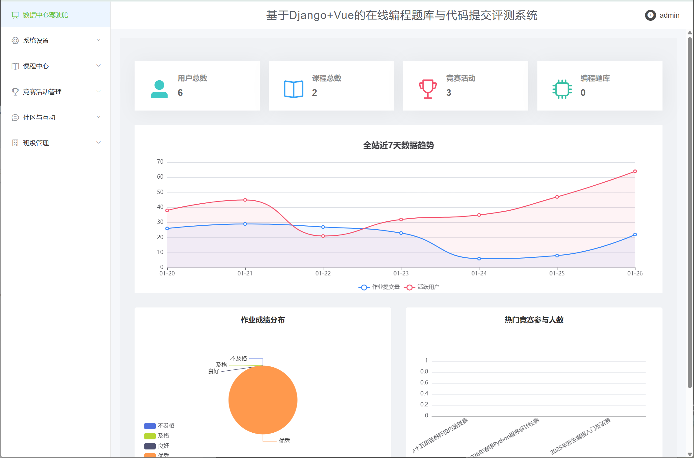

# 🚀 基于 Django + Vue 的在线编程题库与代码提交评测系统

[](https://vuejs.org/)
[](https://www.djangoproject.com/)
[](https://element.eleme.io/)
[](https://www.python.org/)

**IntelliCode Campus** 是一个集课程学习、作业提交、编程竞赛、智能测评于一体的综合性在线教育平台。系统采用前后端分离架构，致力于为高校师生提供高效、智能的编程教学辅助工具。

---

## 🛠️ 技术栈 (Tech Stack)

### 前端 (Frontend)
- **核心框架**: Vue.js
- **UI 组件库**: Element UI
- **图表库**: Echarts (用于数据驾驶舱)
- **网络请求**: Axios
- **路由管理**: Vue Router
- **状态管理**: Vuex

### 后端 (Backend)
- **核心框架**: Django 5.2
- **API 框架**: Django REST Framework (DRF)
- **身份认证**: Token Authentication
- **跨域处理**: django-cors-headers
- **数据库**: SQLite (开发环境) / MySQL (生产环境建议)

---

## 📂 目录结构 (Directory Structure)

```text
intellicode-campus/
├── backend/                # Django 后端项目目录
│   ├── intellicode_campus/ # 核心配置 (settings.py, urls.py)
│   ├── users/              # 用户与认证模块
│   ├── courses/            # 课程与作业模块
│   ├── competitions/       # 竞赛与题库模块
│   ├── community/          # 社区与公告模块
│   ├── system/             # 系统管理与仪表盘
│   ├── media/              # 上传文件存储
│   └── manage.py           # Django 管理入口
│
├── frontend/               # Vue 前端项目目录 (原 intellicode-campus-web)
│   ├── src/
│   │   ├── api/            # 接口管理
│   │   ├── views/          # 页面组件
│   │   ├── components/     # 公共组件
│   │   └── ...
│   ├── package.json
│   └── vue.config.js
│
└── README.md               # 项目说明文档
```


## 🚀 快速开始 (Quick Start)

### 1. 后端环境搭建 (Backend Setup)

确保您的电脑已安装 `Python 3.10+` 和 `Git`。

Bash

```
# 1. 进入后端目录
cd backend

# 2. 创建虚拟环境 (推荐)
python -m venv venv

# 3. 激活虚拟环境
# Windows:
venv\Scripts\activate
# Mac/Linux:
source venv/bin/activate

# 4. 安装依赖
pip install django djangorestframework django-cors-headers django-filter pillow

# 5. 数据库迁移
python manage.py makemigrations
python manage.py migrate

# 6. 创建超级管理员账号
python manage.py createsuperuser
# (按提示输入用户名、邮箱和密码)

# 7. 启动后端服务
python manage.py runserver
```

后端服务默认运行在：`http://127.0.0.1:8000`

------

### 2. 前端环境搭建 (Frontend Setup)

确保您的电脑已安装 `Node.js (LTS版本)`。

Bash

```
# 1. 进入前端目录
cd frontend  # (或者是您的实际前端文件夹名，如 intellicode-campus-web)

# 2. 安装依赖
npm install --registry=[https://registry.npmmirror.com](https://registry.npmmirror.com)

# 3. 启动开发服务器
npm run serve
```

前端服务默认运行在：`http://localhost:8080`

------

## 🔑 默认账号 (Default Accounts)

如果您使用了项目提供的初始化脚本，可以使用以下账号进行测试：

| **角色**   | **账号**   | **密码**       | **权限说明**                   |
| ---------- | ---------- | -------------- | ------------------------------ |
| **管理员** | `admin`    | (您设置的密码) | 拥有所有系统权限，可访问驾驶舱 |
| **教师**   | `teacher1` | `123456`       | 可发布课程、发布作业、批改作业 |
| **学生**   | `student1` | `123456`       | 可选课、提交作业、参加竞赛     |

------

## 📦 部署指南 (Deployment)

### 生产环境建议配置

#### 1. 前端打包

Bash

```
cd frontend
npm run build
```

打包生成 `dist` 目录，需部署到 Nginx 静态服务下。

#### 2. Nginx 配置示例

Nginx

```
server {
    listen 80;
    server_name your_domain.com;

    # 前端静态文件
    location / {
        root /path/to/dist;
        index index.html;
        try_files $uri $uri/ /index.html;
    }

    # 后端 API 代理
    location /api/ {
        proxy_pass [http://127.0.0.1:8000/api/](http://127.0.0.1:8000/api/);
        proxy_set_header Host $host;
        proxy_set_header X-Real-IP $remote_addr;
    }

    # 媒体文件 (图片/附件)
    location /media/ {
        alias /path/to/backend/media/;
    }
}
```

